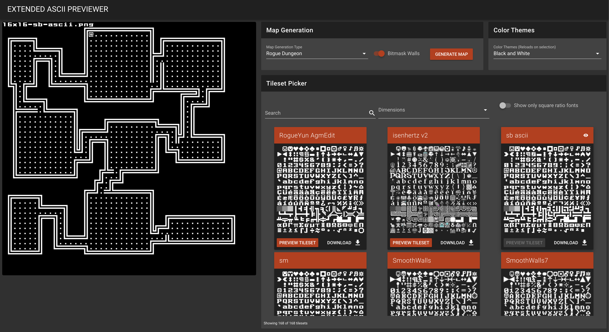

# extended-ascii-previewer

### About

When creating a roguelike or text-graphics game, one of the most important parts is selecting a font / tileset! This application aims to make it easier to visually see what different extended ascii (IBM Code Page 437) tilesets look like. All of the tilesets are from the Dwarf Fortress tileset repository http://dwarffortresswiki.org/Tileset_repository.



### Features
With this application, you can select different tilesets and dynamically reload the currently generated map on the left. You can also select from several different map generation techniques and rerender the map. You can toggle on/off the bitmasking of the wall tiles as well.

## Project setup
```
yarn install
```

### Compiles and hot-reloads for development
```
yarn run serve
```

### Compiles and minifies for production
```
yarn run build
```

### Customize configuration
See [Configuration Reference](https://cli.vuejs.org/config/).
